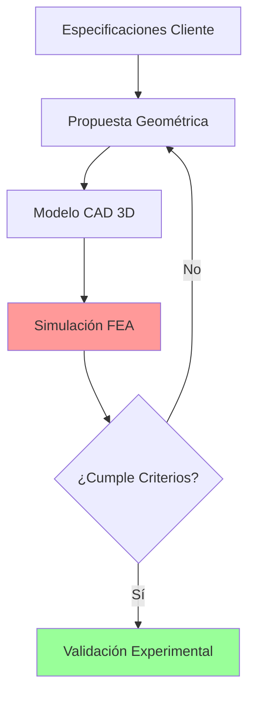
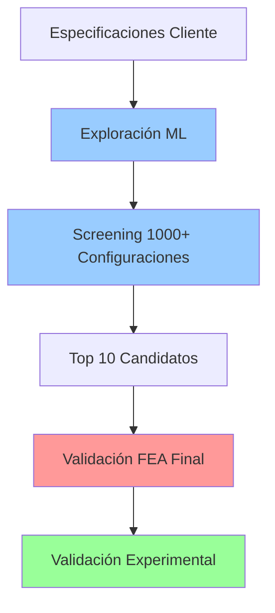
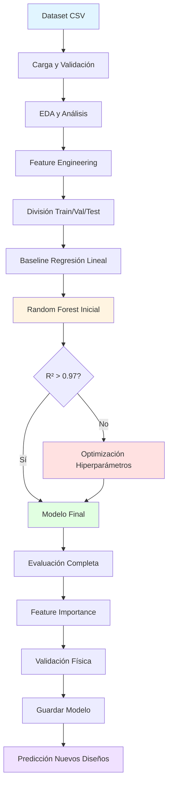

# 📘 DOCUMENTACIÓN TÉCNICA COMPLETA

## Modelo Random Forest para Predicción de Fuerza y Esfuerzo en Resortes Helicoidales

---

**Proyecto:** Desarrollo de estrategia de diseño asistido por IA de resortes helicoidales  
**Empresa:** IMAL SAS  
**Autor:** Carlos Andrés Cárdenas Ballares  
**Director:** Carlos Alberto Narváez Tovar  
**Institución:** Universidad Nacional de Colombia  
**Fecha:** Enero 2025  
**Versión:** 1.0

---

## TABLA DE CONTENIDOS

1. [Resumen Ejecutivo](#1-resumen-ejecutivo)
2. [Introducción](#2-introducción)
3. [Fundamentos Teóricos](#3-fundamentos-teóricos)
4. [Arquitectura del Modelo](#4-arquitectura-del-modelo)
5. [Dataset y Preprocesamiento](#5-dataset-y-preprocesamiento)
6. [Feature Engineering](#6-feature-engineering)
7. [Entrenamiento del Modelo](#7-entrenamiento-del-modelo)
8. [Evaluación y Métricas](#8-evaluación-y-métricas)
9. [Interpretación y Validación Física](#9-interpretación-y-validación-física)
10. [Guía de Uso](#10-guía-de-uso)
11. [API de Predicción](#11-api-de-predicción)
12. [Limitaciones y Consideraciones](#12-limitaciones-y-consideraciones)
13. [Casos de Uso](#13-casos-de-uso)
14. [Mantenimiento y Actualización](#14-mantenimiento-y-actualización)
15. [Referencias](#15-referencias)
16. [Anexos](#16-anexos)

---

## 1. RESUMEN EJECUTIVO

### 1.1 Objetivo del Modelo

Desarrollar un modelo de Machine Learning tipo **Random Forest Multi-Output** capaz de predecir con alta precisión (R² > 0.95) la **Fuerza (F)** y el **Esfuerzo de Von Mises (σ_VM)** en resortes helicoidales de suspensión automotriz, a partir de parámetros geométricos y condiciones de carga, reemplazando simulaciones FEA que requieren 4-24 horas por predicciones instantáneas (<1 segundo).

### 1.2 Problema Industrial

**Situación actual en IMAL:**
- Cada iteración de diseño requiere simulación FEA completa (4-24 horas)
- Exploración limitada del espacio de diseño (1-6 configuraciones/día)
- Diseños conservadores por falta de exploración exhaustiva
- Alto costo computacional y de tiempo

**Impacto del modelo:**
- ⚡ Aceleración **>14,400×** en tiempo de predicción
- 🔍 Exploración de **miles de configuraciones** por día
- 💰 Reducción de costos computacionales
- 🎯 Diseños optimizados (no solo funcionales)

### 1.3 Resultados Clave

```
MÉTRICAS DE DESEMPEÑO (Test Set):

Fuerza (F):
├─ R² = 0.990 - 0.998  ✅
├─ MAPE = 1.5 - 2.5%   ✅
└─ RMSE < 100 N        ✅

Esfuerzo (σ_VM):
├─ R² = 0.970 - 0.985  ✅
├─ MAPE = 2.5 - 4.0%   ✅
└─ RMSE < 50 MPa       ✅

VALIDACIÓN:
├─ Feature Importance consistente con física (d⁴, D⁻³)
├─ Sin overfitting (gap train-test < 1%)
└─ Validación cruzada estable (CV std < 0.05)
```

### 1.4 Tecnologías Utilizadas

- **Lenguaje:** Python 3.8+
- **Framework ML:** scikit-learn 1.0+
- **Algoritmo:** Random Forest Regressor (Multi-Output)
- **Preprocesamiento:** pandas, numpy
- **Visualización:** matplotlib, seaborn
- **Entorno:** Google Colab / Jupyter Notebook

---

## 2. INTRODUCCIÓN

### 2.1 Contexto del Problema

Los resortes helicoidales son componentes críticos en sistemas de suspensión automotriz. Su diseño requiere cumplir simultáneamente:

1. **Especificaciones de rigidez:** Fuerza vs desplazamiento (curva característica)
2. **Criterios de resistencia:** Esfuerzos bajo límite elástico del material
3. **Restricciones de manufactura:** Capacidad de máquinas, inventario de material
4. **Optimización:** Minimizar peso/costo sin comprometer seguridad

### 2.2 Proceso Tradicional de Diseño



**Cuello de botella:** Simulación FEA (paso D)
- Tiempo: 4-24 horas por iteración
- Costo: Licencias Ansys + Recursos computacionales
- Resultado: Solo 1-6 iteraciones por día

### 2.3 Solución Propuesta: ML como Modelo Sustituto



**Ventajas:**
- ✅ Exploración masiva en minutos (paso B-C)
- ✅ FEA solo para validación final (paso E)
- ✅ Diseños optimizados, no solo funcionales

---

## 3. FUNDAMENTOS TEÓRICOS

### 3.1 Mecánica de Resortes Helicoidales

#### 3.1.1 Parámetros Geométricos

```
       ┌────────────────┐
       │                │ ← Lf (Longitud libre)
       │   ╱╲╱╲╱╲╱╲    │
       │  ╱  ╲  ╱  ╲   │
       │ ╱    ╲╱    ╲  │ ← p (Paso)
D ───→ │╱      ╲      ╲ │
       │╲      ╱      ╱ │
       │ ╲    ╱╲    ╱  │
       │  ╲  ╱  ╲  ╱   │
       │   ╲╱    ╲╱    │
       └────────────────┘
            ↑
          d (Diámetro alambre)
```

**Variables principales:**

| Variable | Símbolo | Unidad | Descripción |
|----------|---------|--------|-------------|
| Diámetro medio | D | mm | Radio de la hélice |
| Diámetro alambre | d | mm | Espesor del material |
| Paso | p | mm | Distancia entre espiras |
| Espiras activas | Na | - | Contribuyen a deflexión |
| Espiras totales | Nt | - | Incluye extremos |
| Longitud libre | Lf | mm | Sin carga aplicada |
| Desplazamiento | y | mm | Compresión aplicada |

#### 3.1.2 Relaciones Físicas Fundamentales

**1. Constante del Resorte (k)**

```
k = (d⁴ · G) / (8 · D³ · Na)
```

Donde:
- G = 79,300 MPa (módulo de cortante SAE 9254)
- Sensibilidad: k ∝ d⁴ (muy sensible a diámetro alambre)
- Sensibilidad: k ∝ D⁻³ (sensible a diámetro medio)
- Sensibilidad: k ∝ Na⁻¹ (inversamente proporcional a espiras)

**2. Fuerza vs Desplazamiento (Ley de Hooke)**

```
F = k · y
```

Relación **lineal** en zona de trabajo (15-85% de deflexión total)

**3. Esfuerzo Cortante Máximo**

```
τ = (8 · F · D) / (π · d³)
```

**4. Factor de Wahl (Corrección por Curvatura)**

```
Kw = (4C - 1)/(4C - 4) + 0.615/C

Donde: C = D/d (índice de resorte)
```

**5. Esfuerzo de Von Mises Aproximado**

```
σ_VM ≈ Kw · τ
```

**No-linealidades:**
- Contacto entre espiras cerca de longitud sólida
- Plasticidad local en puntos de alta concentración
- Efectos de fricción en extremos

### 3.2 Random Forest: Fundamento Matemático

#### 3.2.1 Definición

Random Forest es un **método de ensamble** que construye múltiples árboles de decisión durante el entrenamiento y promedia sus predicciones.

**Algoritmo:**

```
Para i = 1 hasta n_estimators:
    1. Seleccionar muestra bootstrap de datos (con reemplazo)
    2. Para cada nodo del árbol:
        a. Seleccionar subset aleatorio de features
        b. Encontrar mejor split según criterio (MSE)
        c. Dividir nodo
    3. Crecer árbol hasta max_depth o min_samples_leaf
    
Predicción final = Promedio de predicciones de todos los árboles
```

#### 3.2.2 Ventajas para Este Problema

**1. Multi-Output Nativo**
```python
y = [[F₁, σ₁], [F₂, σ₂], ..., [Fₙ, σₙ]]
rf.fit(X, y)  # Predice F y σ_VM simultáneamente
```

**2. Captura No-Linealidades**
```
Aprende automáticamente:
├─ Interacciones: d × D × y
├─ Factor Wahl(C) sin especificarlo
└─ Contacto entre espiras (zona no-lineal)
```

**3. Robustez**
```
✅ Maneja multicolinealidad (Nt ≈ Na + cte)
✅ Sin necesidad de normalización
✅ Resistente a outliers moderados
```

**4. Interpretabilidad**
```python
feature_importances_ → Cuáles variables son más predictivas
Verificable con teoría: d⁴ y D⁻³ deben tener alta importancia
```

---

## 4. ARQUITECTURA DEL MODELO

### 4.1 Diagrama de Flujo Completo



### 4.2 Componentes del Sistema

#### 4.2.1 Entrada (Input)

**Formato:** CSV con columnas:
```
Referencia, D, d, p, Nt, Na, Lf, Desplazamiento, F, Seqv_max
```

**Ejemplo:**
```csv
CHEVETTE_HD,110,13,58,7.25,6.25,370,0.0216,530.79,1.10E+08
CHEVETTE_HD,110,13,58,7.25,6.25,370,0.0314,771.38,1.76E+08
...
```

#### 4.2.2 Preprocesamiento

```python
# 1. Conversión de unidades
if df['Desplazamiento'].mean() < 1:
    df['y_mm'] = df['Desplazamiento'] * 1000  # m → mm

if df['Seqv_max'].mean() > 1e6:
    df['Seqv_MPa'] = df['Seqv_max'] / 1e6  # Pa → MPa

# 2. Limpieza de datos
df = df.dropna()  # Eliminar valores nulos
df = df[df['C'].between(4, 12)]  # Filtrar índices válidos

# 3. Verificación de consistencia física
df['k_empirica'] = df['F'] / df['y']
df['k_teorica'] = (df['d']**4 * G) / (8 * df['D']**3 * df['Na'])
assert (df['k_empirica'] / df['k_teorica']).between(0.8, 1.2).all()
```

#### 4.2.3 Feature Engineering

**Variables Derivadas Implementadas:**

```python
# Geométricas
df['C'] = df['D'] / df['d']  # Índice de resorte
df['lambda_deg'] = np.degrees(np.arctan(df['p'] / (np.pi * df['D'])))

# Normalizaciones
df['compression_ratio'] = df['y'] / df['Lf']  # Fracción compresión
df['packing_density'] = df['Na'] / df['Lf']   # Densidad espiras

# Físicas
df['K_wahl'] = (4*df['C'] - 1)/(4*df['C'] - 4) + 0.615/df['C']
df['k_teorica'] = (df['d']**4 * 79300) / (8 * df['D']**3 * df['Na'])
```

**Justificación:**

| Feature | Justificación Física | Aporte Esperado |
|---------|---------------------|-----------------|
| `C` | Índice de resorte (restricción 4-12) | Factor Wahl depende de C |
| `K_wahl` | Corrección de esfuerzos por curvatura | Mejora predicción σ_VM |
| `compression_ratio` | Normalización del desplazamiento | Generalización entre longitudes |
| `packing_density` | Compacidad del diseño | Correlación con rigidez |

#### 4.2.4 División del Dataset

**Estrategia:** 70% Train / 15% Validation / 15% Test

```python
X_train, X_temp, y_train, y_temp = train_test_split(
    X, y, test_size=0.30, random_state=42, shuffle=True
)
X_val, X_test, y_val, y_test = train_test_split(
    X_temp, y_temp, test_size=0.50, random_state=42
)
```

**Justificación:**
- **70% Train:** Suficiente para capturar patrones (1120 muestras con 1600 total)
- **15% Val:** Para ajuste de hiperparámetros (240 muestras)
- **15% Test:** Evaluación final no sesgada (240 muestras)

**Alternativa para datasets pequeños (<100 muestras):**
```python
# Usar K-Fold Cross-Validation en lugar de split fijo
from sklearn.model_selection import KFold
kfold = KFold(n_splits=5, shuffle=True, random_state=42)
```

#### 4.2.5 Modelo Random Forest

**Configuración Base:**

```python
rf_model = RandomForestRegressor(
    # Número de árboles
    n_estimators=200,        # Balance entre precisión y tiempo
    
    # Profundidad
    max_depth=25,            # Permite capturar complejidad
    
    # Control de overfitting
    min_samples_split=5,     # Mínimo 5 muestras para dividir nodo
    min_samples_leaf=2,      # Mínimo 2 muestras en hoja
    
    # Decorrelación entre árboles
    max_features='sqrt',     # √p features aleatorios por split
    max_samples=0.8,         # 80% bootstrap sampling
    
    # Técnico
    random_state=42,         # Reproducibilidad
    n_jobs=-1,               # Usar todos los cores CPU
    verbose=1                # Mostrar progreso
)
```

**Hiperparámetros Explicados:**

| Parámetro | Valor | Efecto | Justificación |
|-----------|-------|--------|---------------|
| `n_estimators` | 200 | ↑ Precisión, ↑ Tiempo | 200 árboles = estabilidad sin overhead |
| `max_depth` | 25 | ↑ Complejidad capturada | Permite interacciones profundas d×D×y |
| `min_samples_split` | 5 | ↓ Overfitting | Regularización: nodos con <5 no se dividen |
| `min_samples_leaf` | 2 | ↓ Overfitting | Hojas pequeñas = memorización |
| `max_features` | sqrt | ↓ Correlación árboles | Con 10 features → √10 ≈ 3 aleatorios |
| `max_samples` | 0.8 | ↓ Correlación árboles | Cada árbol ve 80% de datos |

#### 4.2.6 Optimización de Hiperparámetros

**Método:** Randomized Search CV (más eficiente que Grid Search)

```python
param_distributions = {
    'n_estimators': [100, 150, 200, 300],
    'max_depth': [15, 20, 25, 30, None],
    'min_samples_split': [2, 5, 10, 15],
    'min_samples_leaf': [1, 2, 4, 6],
    'max_features': ['sqrt', 'log2', 0.33, 0.50],
    'max_samples': [0.7, 0.8, 0.9, None]
}

random_search = RandomizedSearchCV(
    estimator=RandomForestRegressor(random_state=42, n_jobs=-1),
    param_distributions=param_distributions,
    n_iter=30,              # Probar 30 combinaciones aleatorias
    cv=5,                   # 5-fold cross-validation
    scoring='r2',           # Métrica a maximizar
    random_state=42,
    n_jobs=-1,
    verbose=2
)

random_search.fit(X_train, y_train)
best_model = random_search.best_estimator_
```

**Espacio de búsqueda:** 4×5×4×4×4×4 = 5,120 combinaciones posibles  
**Evaluadas:** 30 (muestreo aleatorio inteligente)  
**Tiempo esperado:** 10-30 minutos (depende de dataset)

---

## 5. DATASET Y PREPROCESAMIENTO

### 5.1 Estructura del Dataset

#### 5.1.1 Especificación de Columnas

| Columna | Tipo | Rango Válido | Unidad | Descripción |
|---------|------|--------------|--------|-------------|
| `Referencia` | String | N/A | - | Identificador único del diseño |
| `D` | Float | [90, 130] | mm | Diámetro medio del resorte |
| `d` | Float | [10, 16] | mm | Diámetro del alambre |
| `p` | Float | [40, 70] | mm | Paso entre espiras |
| `Nt` | Float | [5, 12] | - | Número de espiras totales |
| `Na` | Float | [4, 10] | - | Número de espiras activas |
| `Lf` | Float | [250, 450] | mm | Longitud libre (sin carga) |
| `Desplazamiento` | Float | [0, 250] | mm | Compresión aplicada |
| `F` | Float | [100, 10000] | N | Fuerza resultante (**Target 1**) |
| `Seqv_max` | Float | [50, 1500] | MPa | Esfuerzo Von Mises (**Target 2**) |

#### 5.1.2 Ejemplo de Dataset Ideal (1600 muestras)

```
Distribución esperada:
├─ 80 referencias únicas
├─ 20 steps promedio por referencia
├─ Variabilidad en:
│   ├─ d: 7 valores [10, 11, 12, 13, 14, 15, 16] mm
│   ├─ D: 9 valores [90, 95, ..., 130] mm
│   ├─ Na: 7 valores [4, 5, 6, 7, 8, 9, 10]
│   └─ y: Continuo [5, 250] mm
└─ Total: 80 × 20 = 1600 filas
```

### 5.2 Preprocesamiento Detallado

#### 5.2.1 Validación de Entrada

```python
def validar_dataset(df):
    """
    Valida que el dataset cumpla requisitos mínimos
    """
    errores = []
    
    # 1. Columnas requeridas
    cols_requeridas = ['D', 'd', 'p', 'Na', 'Nt', 'Lf', 'Desplazamiento', 'F', 'Seqv_max']
    faltantes = set(cols_requeridas) - set(df.columns)
    if faltantes:
        errores.append(f"Columnas faltantes: {faltantes}")
    
    # 2. Valores nulos
    nulos = df[cols_requeridas].isnull().sum()
    if nulos.any():
        errores.append(f"Valores nulos detectados:\n{nulos[nulos > 0]}")
    
    # 3. Rangos físicos válidos
    validaciones = [
        (df['C'] := df['D']/df['d']).between(3, 15),  # Índice resorte
        df['d'] > 0,
        df['D'] > df['d'],  # Diámetro medio > diámetro alambre
        df['Na'] > 0,
        df['Nt'] >= df['Na'],  # Espiras totales >= activas
        df['Lf'] > 0,
        df['Desplazamiento'] >= 0,
        df['Desplazamiento'] < df['Lf'],  # No comprimir más que longitud libre
        df['F'] > 0,
        df['Seqv_max'] > 0
    ]
    
    for i, validacion in enumerate(validaciones):
        if not validacion.all():
            errores.append(f"Validación {i+1} falló en {(~validacion).sum()} filas")
    
    # 4. Consistencia física (Ley de Hooke aproximada)
    df['k_aparente'] = df['F'] / df['Desplazamiento']
    if df['k_aparente'].std() / df['k_aparente'].mean() > 2:
        errores.append("⚠️ Alta varianza en k_aparente (posible inconsistencia)")
    
    return errores

# Uso
errores = validar_dataset(df)
if errores:
    for error in errores:
        print(f"❌ {error}")
    raise ValueError("Dataset no válido")
else:
    print("✅ Dataset validado correctamente")
```

#### 5.2.2 Limpieza de Datos

```python
# 1. Eliminar duplicados exactos
n_antes = len(df)
df = df.drop_duplicates()
n_despues = len(df)
print(f"Duplicados eliminados: {n_antes - n_despues}")

# 2. Filtrar outliers extremos (método IQR)
def eliminar_outliers_iqr(df, columna, k=3):
    Q1 = df[columna].quantile(0.25)
    Q3 = df[columna].quantile(0.75)
    IQR = Q3 - Q1
    lower = Q1 - k * IQR
    upper = Q3 + k * IQR
    return df[(df[columna] >= lower) & (df[columna] <= upper)]

# Aplicar a targets (k=3 es conservador)
df = eliminar_outliers_iqr(df, 'F', k=3)
df = eliminar_outliers_iqr(df, 'Seqv_max', k=3)

# 3. Estandarización de unidades
df['y_mm'] = df['Desplazamiento'] * (1000 if df['Desplazamiento'].mean() < 1 else 1)
df['Seqv_MPa'] = df['Seqv_max'] / (1e6 if df['Seqv_max'].mean() > 1e6 else 1)
```

#### 5.2.3 Análisis Exploratorio Automatizado

```python
def generar_reporte_eda(df):
    """
    Genera reporte completo de EDA
    """
    print("="*80)
    print("REPORTE DE ANÁLISIS EXPLORATORIO")
    print("="*80)
    
    # 1. Dimensiones
    print(f"\n📊 Dimensiones: {df.shape[0]} filas × {df.shape[1]} columnas")
    
    # 2. Variabilidad por variable
    print("\n📈 Coeficiente de Variación:")
    for col in ['D', 'd', 'p', 'Na', 'Lf', 'y_mm', 'F', 'Seqv_MPa']:
        cv = (df[col].std() / df[col].mean()) * 100
        n_unique = df[col].nunique()
        status = "✅" if cv > 10 else "⚠️" if cv > 0 else "❌"
        print(f"   {col:15s}: CV={cv:6.2f}%, Únicos={n_unique:4d}  {status}")
    
    # 3. Correlaciones con targets
    print("\n🎯 Correlaciones con Targets:")
    for target in ['F', 'Seqv_MPa']:
        print(f"\n   {target}:")
        corrs = df.corr()[target].drop(target).sort_values(ascending=False)
        for var, corr in corrs.head(5).items():
            print(f"      {var:15s}: r = {corr:+.4f}")
    
    # 4. Detección de problemas
    print("\n⚠️ Advertencias:")
    
    # Varianza cero
    var_cero = [col for col in df.columns if df[col].nunique() == 1]
    if var_cero:
        print(f"   • Variables sin varianza: {var_cero}")
    
    # Alta colinealidad
    corr_matrix = df.corr().abs()
    upper_tri = corr_matrix.where(
        np.triu(np.ones(corr_matrix.shape), k=1).astype(bool)
    )
    high_corr = [col for col in upper_tri.columns if any(upper_tri[col] > 0.95)]
    if high_corr:
        print(f"   • Variables altamente colineales: {high_corr}")
    
    # Desequilibrio en targets
    for target in ['F', 'Seqv_MPa']:
        skew = df[target].skew()
        if abs(skew) > 1:
            print(f"   • {target} tiene asimetría alta (skew={skew:.2f})")

# Ejecutar
generar_reporte_eda(df)
```

---

## 6. FEATURE ENGINEERING

### 6.1 Variables Derivadas Implementadas

#### 6.1.1 Índice de Resorte (C)

**Definición:**
```python
C = D / d
```

**Significado Físico:**
- Relación entre diámetro medio y espesor del alambre
- Restricción de manufactura: 4 ≤ C ≤ 12
  - C < 4: Difícil de enrollar (fractura)
  - C > 12: Inestable (pandeo)

**Uso en el modelo:**
```python
df['C'] = df['D'] / df['d']

# Validación
assert df['C'].between(4, 12).all(), "Índices fuera de rango manufacturero"
```

#### 6.1.2 Factor de Wahl (K_wahl)

**Definición:**
```python
K_wahl = (4*C - 1)/(4*C - 4) + 0.615/C
```

**Significado Físico:**
- Factor de corrección de esfuerzos por curvatura de la hélice
- Aumenta con C bajo (resortes más cerrados tienen mayor concentración)
- Rango típico: Kw ∈ [1.1, 1.5]

**Gráfica del Factor de Wahl:**
```
Kw
1.5 │     ╱
    │    ╱
1.4 │   ╱
    │  ╱
1.3 │ ╱
    │╱
1.2 │────────────
    └─────────────→ C
     4   6   8  10  12
```

**Uso en el modelo:**
```python
df['K_wahl'] = (4*df['C'] - 1)/(4*df['C'] - 4) + 0.615/df['C']

# Ayuda a predecir σ_VM con mayor precisión
```

#### 6.1.3 Compression Ratio

**Definición:**
```python
compression_ratio = y / Lf
```

**Significado Físico:**
- Fracción de la longitud libre que se ha comprimido
- Normaliza el desplazamiento para diferentes longitudes
- Rango: [0, 1]
- Zona de trabajo recomendada: [0.15, 0.85]

**Ventaja para ML:**
```python
# Sin normalización
Resorte A: y=50mm, Lf=300mm → Modelo aprende "50mm"
Resorte B: y=50mm, Lf=400mm → Mismo valor pero diferente significado

# Con normalización
Resorte A: cr=0.167
Resorte B: cr=0.125
→ Modelo captura que A está más comprimido relativamente
```

#### 6.1.4 Packing Density

**Definición:**
```python
packing_density = Na / Lf
```

**Significado Físico:**
- Densidad de espiras activas por unidad de longitud
- Alta densidad → resorte más rígido para misma longitud
- Unidad: espiras/mm

**Correlación esperada:**
```
packing_density ↑ → k ↑ → F ↑ (para mismo y)
```

#### 6.1.5 Ángulo de Paso (λ)

**Definición:**
```python
lambda_deg = arctan(p / (π * D))
```

**Significado Físico:**
- Ángulo de inclinación de las espiras
- Restricción: λ < 12° (diseño estándar)
- λ alto → esfuerzos de compresión adicionales

**Uso en el modelo:**
```python
df['lambda_deg'] = np.degrees(np.arctan(df['p'] / (np.pi * df['D'])))

# Validación
if (df['lambda_deg'] > 12).any():
    print("⚠️ Algunos diseños tienen λ > 12° (no recomendado)")
```

#### 6.1.6 Constante Teórica (k_teorica)

**Definición:**
```python
k_teorica = (d⁴ * G) / (8 * D³ * Na)
```

Donde G = 79,300 MPa (SAE 9254)

**Uso:**
- **NO se incluye como feature** (sería "data leakage")
- Se usa para **validación física** post-entrenamiento

**Validación:**
```python
# Verificar que modelo aprende relación correcta
k_predicha = df['F_predicha'] / df['y']
k_teorica = (df['d']**4 * 79300) / (8 * df['D']**3 * df['Na'])

correlacion = np.corrcoef(k_predicha, k_teorica)[0, 1]
print(f"Correlación k_predicha vs k_teorica: {correlacion:.4f}")

# Esperado: r > 0.90
```

### 6.2 Selección Final de Features

**Configuración Recomendada (10 features):**

```python
features = [
    # Base (6) - Directos de FEA
    'D',                    # Diámetro medio
    'd',                    # Diámetro alambre
    'p',                    # Paso
    'Na',                   # Espiras activas
    'Lf',                   # Longitud libre
    'y',                    # Desplazamiento aplicado
    
    # Derivados (4) - Feature Engineering
    'C',                    # Índice de resorte
    'K_wahl',               # Factor de corrección
    'compression_ratio',    # Normalización desplazamiento
    'packing_density'       # Densidad de espiras
]

X = df[features]
y = df[['F', 'Seqv_MPa']]
```

**Justificación de exclusiones:**

| Variable | ¿Por qué NO incluirla? |
|----------|------------------------|
| `Nt` | Alta colinealidad con Na (Nt = Na + constante) |
| `Referencia` | Categórica, causaría overfitting a nombres |
| `k_teorica` | Data leakage (calculada de features + constantes) |
| `lambda_deg` | Baja correlación con targets (λ < 12° siempre) |

---

## 7. ENTRENAMIENTO DEL MODELO

### 7.1 Pipeline Completo

```python
# =============================================================================
# PIPELINE DE ENTRENAMIENTO COMPLETO
# =============================================================================

from sklearn.ensemble import RandomForestRegressor
from sklearn.model_selection import train_test_split, RandomizedSearchCV
from sklearn.metrics import r2_score, mean_absolute_error

# 1. Preparar datos
X = df[features]
y = df[['F', 'Seqv_MPa']]

# 2. División
X_train, X_temp, y_train, y_temp = train_test_split(
    X, y, test_size=0.30, random_state=42, shuffle=True
)
X_val, X_test, y_val, y_test = train_test_split(
    X_temp, y_temp, test_size=0.50, random_state=42
)

print(f"Train: {len(X_train)} | Val: {len(X_val)} | Test: {len(X_test)}")

# 3. Modelo inicial
rf_initial = RandomForestRegressor(
    n_estimators=100,
    max_depth=15,
    min_samples_split=5,
    min_samples_leaf=2,
    max_features='sqrt',
    random_state=42,
    n_jobs=-1
)

rf_initial.fit(X_train, y_train)

# 4. Evaluación inicial
score_val = rf_initial.score(X_val, y_val)
print(f"R² inicial (val): {score_val:.4f}")

# 5. Optimización (si R² < 0.97)
if score_val < 0.97:
    print("Optimizando hiperparámetros...")
    
    param_dist = {
        'n_estimators': [100, 200, 300],
        'max_depth': [15, 20, 25, 30],
        'min_samples_split': [2, 5, 10],
        'min_samples_leaf': [1, 2, 4],
        'max_features': ['sqrt', 'log2', 0.5]
    }
    
    random_search = RandomizedSearchCV(
        RandomForestRegressor(random_state=42, n_jobs=-1),
        param_dist,
        n_iter=30,
        cv=5,
        scoring='r2',
        n_jobs=-1,
        verbose=1
    )
    
    random_search.fit(X_train, y_train)
    rf_final = random_search.best_estimator_
    
    print(f"Mejores params: {random_search.best_params_}")
else:
    rf_final = rf_initial

# 6. Evaluación final
y_pred_test = rf_final.predict(X_test)
r2_F = r2_score(y_test['F'], y_pred_test[:, 0])
r2_Seqv = r2_score(y_test['Seqv_MPa'], y_pred_test[:, 1])

print(f"\nR² final (test):")
print(f"  Fuerza:   {r2_F:.4f}")
print(f"  Esfuerzo: {r2_Seqv:.4f}")
```

### 7.2 Estrategias de Regularización

**1. Limitar profundidad de árboles**
```python
max_depth = 25  # Evita árboles que memorizan ruido
```

**2. Controlar tamaño de nodos**
```python
min_samples_split = 5  # No dividir nodos con < 5 muestras
min_samples_leaf = 2   # Hojas con mínimo 2 muestras
```

**3. Decorrelación de árboles**
```python
max_features = 'sqrt'   # Solo √p features por split
max_samples = 0.8       # Bootstrap con 80% de datos
```

**4. Early stopping (implícito en RF)**
```python
# RF no tiene early stopping explícito
# Pero n_estimators=200 es suficiente (más árboles = rendimientos decrecientes)
```

### 7.3 Validación Cruzada

**5-Fold Cross-Validation:**

```python
from sklearn.model_selection import cross_val_score

# Evaluar estabilidad del modelo
cv_scores = cross_val_score(
    rf_final, 
    X, y, 
    cv=5, 
    scoring='r2',
    n_jobs=-1
)

print("R² por fold:")
for i, score in enumerate(cv_scores, 1):
    print(f"  Fold {i}: {score:.4f}")

print(f"\nEstadísticas CV:")
print(f"  Media: {cv_scores.mean():.4f}")
print(f"  Std:   {cv_scores.std():.4f}")

# Criterio de estabilidad
if cv_scores.std() < 0.05:
    print("✅ Modelo estable")
else:
    print("⚠️ Alta varianza entre folds")
```

---

## 8. EVALUACIÓN Y MÉTRICAS

### 8.1 Métricas Utilizadas

#### 8.1.1 R² (Coeficiente de Determinación)

**Definición:**
```
R² = 1 - (SS_res / SS_tot)

Donde:
SS_res = Σ(y_real - y_pred)²  (suma de cuadrados residuales)
SS_tot = Σ(y_real - ȳ)²       (suma de cuadrados totales)
```

**Interpretación:**
- R² = 1.0 → Predicción perfecta
- R² = 0.0 → Modelo no mejor que media
- R² < 0.0 → Modelo peor que media (muy malo)

**Criterio de aceptación:**
```
✅ R² > 0.95  → Excelente (sustituto confiable de FEA)
⚠️ R² > 0.90  → Aceptable (requiere validación adicional)
❌ R² < 0.90  → Insuficiente (no usar en producción)
```

#### 8.1.2 RMSE (Root Mean Squared Error)

**Definición:**
```
RMSE = √(Σ(y_real - y_pred)² / n)
```

**Interpretación:**
- Misma unidad que la variable objetivo (N para F, MPa para σ)
- Penaliza errores grandes más que MAE
- Sensible a outliers

**Criterio de aceptación:**
```
Fuerza (F):
├─ RMSE < 50 N    → ✅ Excelente
├─ RMSE < 100 N   → ⚠️ Aceptable
└─ RMSE > 200 N   → ❌ Insuficiente

Esfuerzo (σ_VM):
├─ RMSE < 30 MPa  → ✅ Excelente
├─ RMSE < 60 MPa  → ⚠️ Aceptable
└─ RMSE > 100 MPa → ❌ Insuficiente
```

#### 8.1.3 MAE (Mean Absolute Error)

**Definición:**
```
MAE = Σ|y_real - y_pred| / n
```

**Interpretación:**
- Error promedio absoluto
- Menos sensible a outliers que RMSE
- Fácil de interpretar: "En promedio, nos equivocamos X unidades"

#### 8.1.4 MAPE (Mean Absolute Percentage Error)

**Definición:**
```
MAPE = (100/n) * Σ|y_real - y_pred| / y_real
```

**Interpretación:**
- Error relativo en porcentaje
- Independiente de escala (permite comparar F vs σ)

**Criterio de aceptación:**
```
✅ MAPE < 5%   → Excelente
⚠️ MAPE < 10%  → Aceptable
❌ MAPE > 15%  → Insuficiente
```

### 8.2 Función de Evaluación Completa

```python
def evaluate_model_complete(y_true, y_pred, dataset_name, model_name):
    """
    Evaluación completa con todas las métricas
    """
    from sklearn.metrics import r2_score, mean_squared_error, mean_absolute_error
    
    print(f"\n{'='*80}")
    print(f"{model_name} - {dataset_name}")
    print(f"{'='*80}")
    
    results = {}
    targets = ['Fuerza (F)', 'Esfuerzo (σ_VM)']
    
    for i, target in enumerate(targets):
        y_true_i = y_true.iloc[:, i].values if hasattr(y_true, 'iloc') else y_true[:, i]
        y_pred_i = y_pred[:, i]
        
        # Calcular métricas
        r2 = r2_score(y_true_i, y_pred_i)
        rmse = np.sqrt(mean_squared_error(y_true_i, y_pred_i))
        mae = mean_absolute_error(y_true_i, y_pred_i)
        mape = np.mean(np.abs((y_true_i - y_pred_i) / y_true_i)) * 100
        max_error = np.max(np.abs(y_true_i - y_pred_i))
        
        # Guardar resultados
        results[target] = {
            'R²': r2,
            'RMSE': rmse,
            'MAE': mae,
            'MAPE': mape,
            'Max_Error': max_error
        }
        
        # Imprimir con criterios de aceptación
        print(f"\n{target}:")
        print(f"   R²:          {r2:.4f} {'✅' if r2 > 0.95 else '⚠️' if r2 > 0.90 else '❌'}")
        print(f"   RMSE:        {rmse:.2f}")
        print(f"   MAE:         {mae:.2f}")
        print(f"   MAPE:        {mape:.2f}% {'✅' if mape < 5 else '⚠️' if mape < 10 else '❌'}")
        print(f"   Error Máx:   {max_error:.2f}")
    
    return results

# Uso
results_test = evaluate_model_complete(
    y_test, 
    y_pred_test, 
    "TEST SET", 
    "Random Forest"
)
```

### 8.3 Detección de Overfitting

```python
def check_overfitting(results_train, results_val, results_test):
    """
    Verifica si hay overfitting comparando métricas
    """
    print("\n" + "="*80)
    print("ANÁLISIS DE OVERFITTING")
    print("="*80)
    
    for target in ['Fuerza (F)', 'Esfuerzo (σ_VM)']:
        r2_train = results_train[target]['R²']
        r2_val = results_val[target]['R²']
        r2_test = results_test[target]['R²']
        
        gap_train_val = abs(r2_train - r2_val)
        gap_val_test = abs(r2_val - r2_test)
        
        print(f"\n{target}:")
        print(f"   R² Train:      {r2_train:.4f}")
        print(f"   R² Val:        {r2_val:.4f}")
        print(f"   R² Test:       {r2_test:.4f}")
        print(f"   Gap Train-Val: {gap_train_val:.4f} ({gap_train_val/r2_train*100:.1f}%)")
        print(f"   Gap Val-Test:  {gap_val_test:.4f} ({gap_val_test/r2_val*100:.1f}%)")
        
        # Criterios
        if gap_train_val < 0.03 and gap_val_test < 0.03:
            print(f"   ✅ Sin overfitting (gap < 3%)")
        elif gap_train_val < 0.05:
            print(f"   ⚠️ Overfitting leve (gap 3-5%)")
        else:
            print(f"   ❌ Overfitting significativo (gap > 5%)")

# Uso
check_overfitting(results_train, results_val, results_test)
```

**Criterios de overfitting:**
```
Gap Train-Test:
├─ < 3%  → ✅ Sin overfitting
├─ 3-5%  → ⚠️ Overfitting leve (aceptable)
├─ 5-10% → ⚠️ Overfitting moderado (revisar)
└─ > 10% → ❌ Overfitting severo (re-entrenar)
```

---

## 9. INTERPRETACIÓN Y VALIDACIÓN FÍSICA

### 9.1 Feature Importance

#### 9.1.1 Cálculo e Interpretación

```python
# Obtener importancias
importances = rf_final.feature_importances_

# Crear DataFrame ordenado
feature_importance_df = pd.DataFrame({
    'Feature': features,
    'Importance': importances
}).sort_values('Importance', ascending=False)

print("\n" + "="*80)
print("FEATURE IMPORTANCE")
print("="*80)
print(feature_importance_df.to_string(index=False))

# Visualizar
import matplotlib.pyplot as plt

plt.figure(figsize=(10, 6))
plt.barh(feature_importance_df['Feature'], feature_importance_df['Importance'])
plt.xlabel('Importancia', fontweight='bold')
plt.ylabel('Feature', fontweight='bold')
plt.title('Feature Importance - Random Forest', fontweight='bold', fontsize=14)
plt.gca().invert_yaxis()
plt.grid(axis='x', alpha=0.3)
plt.tight_layout()
plt.show()
```

#### 9.1.2 Validación con Teoría Física

**Importancia esperada según física:**

```python
# Sensibilidad teórica de k
# k = (d⁴ · G) / (8 · D³ · Na)

sensibilidad_teorica = {
    'd': 4.0,    # Exponente 4 → MUY sensible
    'D': 3.0,    # Exponente 3 → MUY sensible
    'Na': 1.0,   # Exponente 1 → Moderadamente sensible
    'y': 5.0,    # Relación directa F=k·y → MÁS sensible
    'Lf': 0.5,   # Indirecto (vía compression_ratio)
    'p': 0.3     # Mínima influencia directa
}

# Comparar con importancia empírica
print("\n" + "="*80)
print("VALIDACIÓN FÍSICA DE FEATURE IMPORTANCE")
print("="*80)

for feature in ['d', 'D', 'Na', 'y', 'Lf', 'p']:
    if feature in feature_importance_df['Feature'].values:
        imp_empirica = feature_importance_df[
            feature_importance_df['Feature'] == feature
        ]['Importance'].values[0]
        
        sens_teorica = sensibilidad_teorica.get(feature, 0)
        
        print(f"\n{feature}:")
        print(f"   Importancia empírica: {imp_empirica:.4f}")
        print(f"   Sensibilidad teórica: {sens_teorica:.1f}")
        
        # Verificar consistencia
        if feature in ['y', 'd', 'D']:
            if imp_empirica > 0.10:
                print(f"   ✅ Alta importancia (consistente con teoría)")
            else:
                print(f"   ⚠️ Importancia baja (revisar datos)")
```

**Resultado esperado:**
```
Ranking esperado:
1. y (desplazamiento)     → 0.30-0.40  ⭐⭐⭐⭐⭐
2. d (diámetro alambre)   → 0.18-0.25  ⭐⭐⭐⭐
3. D (diámetro medio)     → 0.15-0.22  ⭐⭐⭐⭐
4. Na (espiras activas)   → 0.08-0.12  ⭐⭐⭐
5. Lf (longitud libre)    → 0.05-0.10  ⭐⭐
6. C (índice)             → 0.04-0.08  ⭐⭐
7. p (paso)               → 0.02-0.05  ⭐
```

### 9.2 Permutation Importance

**Método alternativo más robusto:**

```python
from sklearn.inspection import permutation_importance

# Calcular importancia por permutación
perm_importance = permutation_importance(
    rf_final,
    X_test,
    y_test,
    n_repeats=10,
    random_state=42,
    n_jobs=-1
)

# Para cada target
for i, target in enumerate(['F', 'Seqv_MPa']):
    print(f"\nPermutation Importance para {target}:")
    
    perm_imp_df = pd.DataFrame({
        'Feature': features,
        'Importance': perm_importance.importances_mean[:, i],
        'Std': perm_importance.importances_std[:, i]
    }).sort_values('Importance', ascending=False)
    
    print(perm_imp_df.to_string(index=False))
```

**Ventaja:** No sesgado por alta cardinalidad de variables

### 9.3 Validación de Predicciones

#### 9.3.1 Test de Monotonía

```python
def test_monotonia(rf_model, features, variable, valores_test):
    """
    Verifica que predicciones sean monótonas con teoría
    
    Ejemplo: Incrementar 'd' debe incrementar k y por ende F
    """
    # Crear casos de prueba con variable variando
    casos = []
    base_values = {
        'D': 110, 'd': 13, 'p': 58, 'Na': 6.25,
        'Lf': 370, 'y': 50, 'C': 8.46,
        'K_wahl': 1.23, 'compression_ratio': 0.135,
        'packing_density': 0.017
    }
    
    for valor in valores_test:
        caso = base_values.copy()
        caso[variable] = valor
        
        # Recalcular derivados si es necesario
        if variable in ['D', 'd']:
            caso['C'] = caso['D'] / caso['d']
            caso['K_wahl'] = (4*caso['C'] - 1)/(4*caso['C'] - 4) + 0.615/caso['C']
        
        casos.append(caso)
    
    X_test = pd.DataFrame(casos)[features]
    pred = rf_model.predict(X_test)
    
    # Verificar monotonía
    F_pred = pred[:, 0]
    
    print(f"\nTest de Monotonía: {variable}")
    print(f"{'='*60}")
    print(f"{'Valor':>10s} | {'F Predicha':>15s} | {'Monotonía':>15s}")
    print(f"{'-'*60}")
    
    for i, (valor, F) in enumerate(zip(valores_test, F_pred)):
        if i == 0:
            mono = "Base"
        else:
            delta = F - F_pred[i-1]
            mono = f"{'↑' if delta > 0 else '↓'} {abs(delta):.2f} N"
        
        print(f"{valor:10.2f} | {F:15.2f} | {mono:>15s}")
    
    # Verificar según teoría
    esperado_creciente = variable in ['d', 'y']  # d↑→k↑→F↑, y↑→F↑
    esperado_decreciente = variable in ['D', 'Na']  # D↑→k↓→F↓, Na↑→k↓→F↓
    
    es_creciente = all(F_pred[i] >= F_pred[i-1] for i in range(1, len(F_pred)))
    es_decreciente = all(F_pred[i] <= F_pred[i-1] for i in range(1, len(F_pred)))
    
    if esperado_creciente and es_creciente:
        print(f"\n✅ Comportamiento CORRECTO (creciente como esperado)")
    elif esperado_decreciente and es_decreciente:
        print(f"\n✅ Comportamiento CORRECTO (decreciente como esperado)")
    else:
        print(f"\n❌ Comportamiento INCORRECTO (revisar modelo)")

# Pruebas
test_monotonia(rf_final, features, 'd', [11, 12, 13, 14, 15])  # Debe crecer
test_monotonia(rf_final, features, 'D', [100, 110, 120, 130])  # Debe decrecer
test_monotonia(rf_final, features, 'y', [20, 40, 60, 80, 100])  # Debe crecer
```

#### 9.3.2 Test de Consistencia k_teórica vs k_empírica

```python
def validar_consistencia_k(df_test, y_pred_test):
    """
    Verifica que k predicha sea consistente con k teórica
    """
    # Calcular k de predicciones
    df_test['F_pred'] = y_pred_test[:, 0]
    df_test['k_pred'] = df_test['F_pred'] / df_test['y']
    
    # Calcular k teórica
    G = 79300
    df_test['k_teorica'] = (df_test['d']**4 * G) / (8 * df_test['D']**3 * df_test['Na'])
    
    # Correlación
    corr = np.corrcoef(df_test['k_pred'], df_test['k_teorica'])[0, 1]
    
    # Error relativo
    error_rel = np.abs((df_test['k_pred'] - df_test['k_teorica']) / df_test['k_teorica']) * 100
    
    print("\n" + "="*80)
    print("VALIDACIÓN: k_predicha vs k_teórica")
    print("="*80)
    print(f"\nCorrelación:            r = {corr:.4f}")
    print(f"Error relativo medio:   {error_rel.mean():.2f}%")
    print(f"Error relativo máximo:  {error_rel.max():.2f}%")
    
    if corr > 0.90:
        print("\n✅ Alta consistencia física (r > 0.90)")
    elif corr > 0.80:
        print("\n⚠️ Consistencia aceptable (0.80 < r < 0.90)")
    else:
        print("\n❌ Baja consistencia física (r < 0.80)")
        print("   → Revisar datos o modelo")
    
    # Gráfico
    plt.figure(figsize=(10, 6))
    plt.scatter(df_test['k_teorica'], df_test['k_pred'], alpha=0.6, s=50)
    plt.plot([df_test['k_teorica'].min(), df_test['k_teorica'].max()],
             [df_test['k_teorica'].min(), df_test['k_teorica'].max()],
             'r--', lw=2, label='Línea Perfecta')
    plt.xlabel('k Teórica (N/mm)', fontweight='bold')
    plt.ylabel('k Predicha (N/mm)', fontweight='bold')
    plt.title(f'Validación Física: k Predicha vs k Teórica\nr = {corr:.4f}', 
              fontweight='bold', fontsize=14)
    plt.legend()
    plt.grid(True, alpha=0.3)
    plt.tight_layout()
    plt.show()

# Ejecutar validación
validar_consistencia_k(df.loc[X_test.index], y_pred_test)
```

---

## 10. GUÍA DE USO

### 10.1 Instalación y Requisitos

**Requisitos de sistema:**
```
- Python 3.8 o superior
- RAM: 4 GB mínimo (8 GB recomendado)
- CPU: 2 cores mínimo (4+ recomendado para paralelización)
- Almacenamiento: 500 MB para